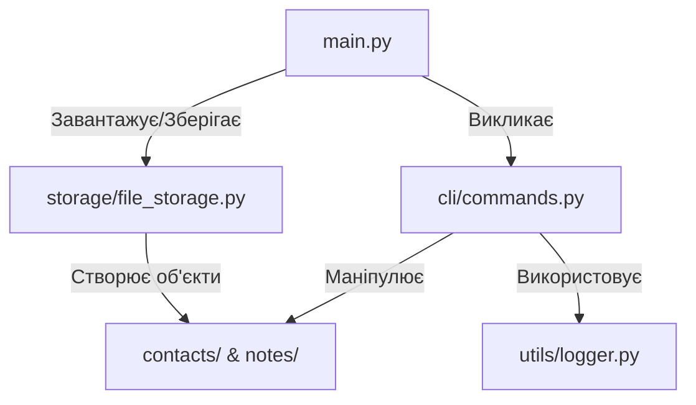

# Nadiia Personal Assistant

CLI Personal Assistant **"NADIIA2"**

Потужний консольний бот-помічник для організації ваших контактів та нотаток. Створений з фокусом на простоту, ефективність та сучасний CLI-інтерфейс.

***

## Можливості (Features)

### Адресна Книга (Contacts)
- **Управління:** Додавання, редагування (телефон, email, день народження, адреса) та видалення контактів.
- **Пошук:** Повнотекстовий пошук контактів за будь-яким полем: ім'ям, телефоном, адресою чи email (команда `find-contact`).
- **Перегляд:** Виведення всіх контактів у відформатованій таблиці (команда `all-contacts`).
- **Дні народження:** Перегляд іменинників на наступні 7 днів (за замовчуванням) або на будь-який вказаний період (команда `birthdays [дні]`). Виводить розширену інформацію: дату народження, вік, дату привітання та зворотний відлік.

### Нотатки (Notes)
- **Управління:** Створення, редагування та видалення текстових нотаток.
- **Теги:** Призначення тегів до нотаток (додавання/видалення) для кращої організації.
- **Пошук:** Повнотекстовий пошук або пошук за текстом чи тегами за допомогою ключів (команда `find-note`).
- **Перегляд:** Табличний перегляд усіх наявних нотаток (команда `all-notes`).

***

## Архітектура (Architecture)

Проєкт побудований за багатошаровою архітектурою для забезпечення чистоти коду та легкого тестування:

1.  **Точка входу (`main.py`)**: Керує основним циклом (REPL), налаштовує автодоповнення (`questionary`) та координує роботу між шарами.
2.  **Шари CLI (`cli/`)**:
    - `commands.py`: Містить логіку обробки кожної команди.
    - `constants.py`: Зберігає текстові константи, підказки та налаштування інтерфейсу.
    - `validators.py`: Декоратори для обробки помилок вводу.
3.  **Доменний шар (`contacts/`, `notes/`)**:
    - Реалізує бізнес-логіку (класи `AddressBook`, `Record`, `Notebook`, `Note`).
    - Відповідає за валідацію даних (телефони, дати, email).
4.  **Шар збереження (`storage/`)**:
    - `file_storage.py`: Відповідає за серіалізацію та десеріалізацію даних у формат JSON.
5.  **Допоміжний шар (`utils/`)**:
    - Реалізує логування (`logger.py`) та загальні допоміжні функції.

### Схема взаємодії



## Швидкий Старт (Quick Start)

### 1. Клонування репозиторію
```bash
git clone https://github.com/RonaRomanova/project-personal-assistant-nadiia.git
cd project-personal-assistant-nadiia
```

### 2. Створення та активація віртуального середовища (Обов'язково!)
> **Важливо:** Проєкт повинен запускатися ізольовано у віртуальному середовищі!

Розроблявся і тестувався під Python 3.12.4

**Запуск на Mac/Linux:**
```bash
python3 -m venv venv
source venv/bin/activate
```
**Запуск на Windows:**
```powershell
python -m venv venv
.\venv\Scripts\activate
```

### 3. Встановлення залежностей
```bash
pip install -r requirements.txt
```

### 4. Запуск додатку
```bash
python main.py
```
> Після запуску ви можете ввести команду `help`, щоб переглянути список усіх доступних команд та їх формат. При виході з програми (`exit` або `close`) ви отримаєте повні шляхи до файлів зберігання (JSON) у вигляді клікабельних URL.

***

## Залежності та Best Practices
Проєкт дотримується сучасних Python Best Practices і використовує відповідні інструменти розробки:

- **CLI Інтерфейс:**
  - `Rich` та `PrettyTable`: Використовуються для створення структурованого та кольорового виводу в терміналі.
- **Код стайл та Лінтери (Code Quality):**
  - Увесь код суворо відповідає стандарту **PEP 8** (обмеження довжини рядків 79 символів, форматування).
  - Для підтримки стилю використовуються `Ruff`, `Flake8` та `AutoPEP8`.
- **Тестування:**
  - Як основний фреймворк для тестів в проєкті налаштований сучасний `pytest` (також підтримується стандартний `unittest`).

### 🔍 Перевірка коду (Для розробників)
У проєкті налаштований жорсткий контроль якості коду. Перед створенням Pull Request переконайтесь, що ви виконали форматування:

```bash
# Перевірка на сувору відповідність PEP 8:
flake8 .
ruff check .

# Автоматичне виправлення проблем форматування:
ruff format .
autopep8 --in-place --recursive .
```

### 🧪 Запуск тестів
```bash
pytest tests/ -v
# Або через стандартну бібліотеку:
# python -m unittest discover tests -v
```

***

## Внесок у проєкт (Workflow)

Ми дотримуємося стандартного Git Flow:
1. Створення нової гілки для задачі: `git checkout -b feature/ваша-назва-задачі`
2. Розробка та локальне тестування. Код повинен успішно проходити перевірки `flake8` / `ruff`.
3. Передача в тестування та створення Pull Request (PR) на головну гілку.
4. Code Review від інших розробників.
5. Merge у головну гілку після апруву.

**Життєвий цикл задачі:**<br>
`Розробка` → `Тестувальник` → `Pull Request` → `Code Review` → `Merge`

***

## Корисні посилання
- [Google Doc з вимогами/ТЗ](https://docs.google.com/document/d/1wiksgjxgH3s9s5ZzH8-WpYMi4or5L8XeeicnXfRO8dk/edit?tab=t.0)
- [Agile Board (Trello)](https://trello.com/b/deW9VxgM/project-personal-assistant-nadiia)
